  

  <strong>Interactive narrative experience — explore, discover, and find your way home.</strong>

  
  

  
  

### Languages

  
  
  

### Stack

  
  

  Built by <strong>Angela Hudson</strong> · <a href="https://github.com/DaCameraGirl">DaCameraGirl</a>

# Lost Little Girl Paths

An atmospheric branching story game about Michaela, a lost little girl trying to find the safest way home through seven family-marked midnight routes.

- Seven route openings with twenty-one archiveable endings
- Family characters for Mom, Jeremy, Nicholas, Michael, Michaela, Trent, Haley, and Chase
- Courage, signal, and shadow meters that change with choices
- Items and clues that unlock safer options
- Route map, path log, and persistent ending archive
- Browser local save support
- Optional narration and ambient sound
- Responsive static HTML/CSS/JS with no build step

Open `index.html` in a browser.

- `index.html` - app shell and UI regions
- `styles.css` - responsive visual design and scene artwork
- `app.js` - story data, game state, persistence, narration, and audio